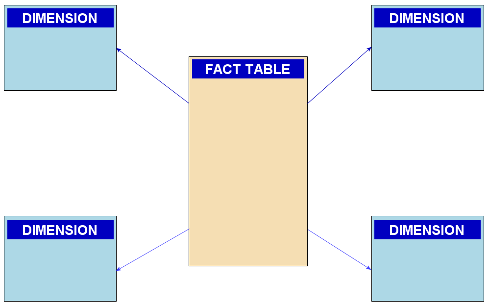
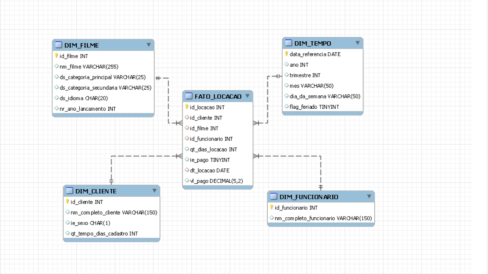

#RESUMO BI

-O QUE É O BI?
-É um processo de coleta de dados e transformação em informação, e a informação em conhecimento, para que possa ser tomada uma decisão.

-Temos a facilidade para gerar relatórios, gráficos, dashboards, etc.

-ETAPAS DO BI
-Coleta de dados
-Transformação de dados em informação
-Transformação de informação em conhecimento
-Tomada de decisão

-QUAL A FUNCIONALIDADE DO BI?
-O BI tem a funcionalidade de gerar relatórios, gráficos, dashboards, etc.

-MANEIRAS DE VISUALIZAR OS DADOS
-Tabela
-Gráfico
-Dashboard

-----MANEIRAS DE COLETAR OS DADOS------------

-Meios eletrônicos
-Sistemas de informação
-Planilhas
-Banco de dados
-Arquivos de texto
-Arquivos XML
-Arquivos JSON
-Arquivos CSV
-Arquivos PDF
-Arquivos de imagem
-Arquivos de áudio
-Arquivos de vídeo
-Arquivos de log
-Arquivos de backup
-Arquivos de configuração
-Arquivos de instalação
-Papeis de trabalho

(((((((((((((((((((CAI NA PROVA)))))))))))))))))))
-O QUE É OLAP?
-OLAP (Online Analytical Processing) é uma técnica de análise usada em Business Intelligence (BI) para explorar e analisar dados multidimensionais de forma interativa, permitindo consultas complexas e insights.

    -O QUE É OLTP?
     -OLTP (Online Transaction Processing) é um sistema que trata de transações em tempo real em bancos de dados, otimizado para operações diárias de negócios, como inserções e atualizações de dados.

    -O QUE É ETL?
        -ETL (Extract, Transform and Load) é um processo de integração de dados que envolve a extração de dados de fontes externas, transformação para atender aos requisitos de negócios e carregamento em um sistema de destino.
        -O ETL é usado para mover dados de um sistema para outro, geralmente de um sistema operacional para um data warehouse.
        -O ETL é uma parte importante do processo de BI, pois ajuda a obter dados de várias fontes e transformá-los em um formato adequado para análise.

    -O QUE É MODELAGEM DE DADOS?
     -Modelagem de dados é o processo de criação de um modelo de dados para armazenar dados em um banco de dados.
     -O modelo de dados é usado para representar a estrutura lógica dos dados e as relações entre eles.
     -O modelo de dados é usado para criar o banco de dados físico.

    -FAZEMOS AS CONSULTAS NO BANCO DE DADOS MySQL

    -TABELA
     -É uma forma de visualizar os dados em forma de tabela, com linhas e colunas.

    -GRÁFICO
     -É uma forma de visualizar os dados em forma de gráfico, com barras, linhas, etc.

-DASHBOARD - É um painel de controle, onde podemos visualizar os dados de forma mais dinâmica, com gráficos, tabelas, etc.

    -DATA MINING
     -É uma forma de minerar os dados, para que possa ser feito uma análise e tomada de decisão.

    -DATA MART
        -É um banco de dados que armazena dados de uma área específica de uma empresa, para que possa ser feito análises e tomadas de decisões.

    -DATA WAREHOUSE
        -É um banco de dados que armazena dados históricos de uma empresa, para que possa ser feito análises e tomadas de decisões.
        -No data warehouse é onde ligamos todos os dados através de importações de dados de várias fontes.

-ARQUITETURA DO DATAWAREHOUSE
-DATA SOURCE
-É uma fonte de dados, onde os dados são armazenados.
-Exemplos de data source: Banco de dados, planilhas, arquivos de texto, arquivos XML, arquivos JSON, arquivos CSV, arquivos PDF, arquivos de imagem, arquivos de áudio, arquivos de vídeo, arquivos de log, arquivos de backup, arquivos de configuração, arquivos de instalação, papeis de trabalho, etc.

    -Staging Area
        -É uma área de armazenamento temporário, onde os dados são armazenados antes de serem carregados no data warehouse.

    -DATA WAREHOUSE

    -DATA MARTS
        -É um banco de dados que armazena dados de uma área específica de uma empresa, para que possa ser feito análises e tomadas de decisões.
        -No data mart é onde ligamos todos os dados através de importações de dados de várias fontes.

    -USERS
        -São os usuários que acessam os data marts para fazer análises e tomadas de decisões.

--------CAMADAS DO BI---------------

1)CAMADA DE FRONT-END
-É a camada onde podemos ver nossos resultados
-Aqui usamos o POWERBI

2)CAMADA INTERMEDIA
-Essa camada irá fornecer mecanismos que são usados para acessar os dados

3)CAMADA INFERIOR
-É a camada onde fica toda a nossa estrutura e arquitetura contendo o servidor dos dados, banco de dados, etc.

-VANTAGENS DO BI
-Facilidade para gerar relatórios, gráficos, dashboards, etc.

-FERRAMENTAS QUE USAMOS NO BI

Uso de Docker, MySQL e Pentaho no BI:

----------DOCKER--------------
Docker é uma plataforma para criar, implantar e gerenciar aplicativos em contêineres.
Facilita o empacotamento de aplicativos e suas dependências para implantação consistente.
No BI, Docker é usado para criar ambientes consistentes e portáteis para ferramentas e soluções de BI.

----------MYSQL--------------
MySQL é um sistema de gerenciamento de banco de dados (SGBD) de código aberto.
É usado para armazenar e gerenciar dados em um formato estruturado.
No BI, MySQL pode ser usado como um repositório de dados para análises e relatórios.

----------PENTAHO--------------
Pentaho é uma suíte de ferramentas de BI de código aberto que inclui recursos de ETL, relatórios, análises e mineração de dados.
É usado para coletar, transformar e visualizar dados para análises de negócios.
Pentaho pode ser implantado em contêineres Docker para facilitar a configuração e o gerenciamento em ambientes de BI.

---------DOCUMENTAÇÃO EM BI--------------
Documentação é um processo de documentar o que foi feito no BI, para que possa ser usado como referência para futuros projetos.
A documentação pode ser feita em forma de texto, vídeo, etc.

(((((((((((((((CAI NA PROVA)))))))))))))))

---------MATRIZ DIMENSÃO X INDICADOR--------------

-Depois do levantamento das informações, é elaborado um documento contendo todas as informações necessárias que foram coletadas ou que sejam importantes para o fluxo

-LINHAS E COLUNAS
-As linhas são os indicadores
-As colunas são as dimensões

-INDICADORES
-São os dados que serão analisados
-Exemplos de indicadores: Vendas, lucro, despesas, etc.

-DIMENSÕES
-Como iremos analisar os dados
-Exemplos de dimensões: Tempo, produto, região, etc.

-EXEMPLO DE MATRIZ DIMENSÃO X INDICADOR

    -INDICADORES
        -Vendas
        -Lucro
        -Despesas

    -DIMENSÕES
        -Tempo
        -Produto
        -Região

-------ENTIDADES-------------

-Um objeto do mundo real que é modelado dentro de um sistema de software e é descrito por um conjunto de atributos e comportamentos é chamado de entidade.
-Exemplos de entidades: Pessoa, carro, casa, etc.

-RELACIONAMENTOS ENTRE ENTIDADES
-Um relacionamento é uma conexão entre entidades.
-Exemplos de relacionamentos: Pessoa compra carro, pessoa aluga casa, etc.

-ATRIBUTOS
-São as características das entidades
-Exemplos de atributos: Nome, idade, sexo, cor, etc.

---MODELOS DE DADOS------------

-Modelo de dados é uma representação de como os dados são armazenados e acessados.

-MODELO STAR SCHEMA
-Modelo mais simples, tem forma de estrela
-É composto por uma tabela fato e várias tabelas dimensões
-TABELA FATO = TABELA CENTRAL
-TABELAS DIMENSÕES = TABELAS QUE ESTÃO EM VOLTA DA TABELA CENTRAL
-Apenas um nivel de relacionamento com as tabelas dimensões
-Indicadores são armazenados na tabela fato
-Dimensões são armazenadas nas tabelas dimensões
-Exemplo de modelo star schema:
-TABELA FATO = VENDAS
-TABELAS DIMENSÕES = TEMPO, PRODUTO, REGIÃO

---DENTRO DO WORKBENCH
-FILE > NEW MODEL > ADD DIAGRAM

--CRIAR NOVO MODELO
-Clicar na primeia tabelinha do lado esquerdo e arrastar para o meio da tela
-Clicar duas vezes na tabelinha e colocar o nome da tabela
-Clicar duas vezes no espaço em branco debaixo do nome da tabela e colocar o nome do atributo

    -LIGAÇÕES EM STAR SCHEMA SÃO SEMPRE 1(FATO) PARA N (DIMENSÕES)
    -Selecionar 1 N (LINHA RETA NÃO PONTILHADA) e clicar na tabela fato e depois na tabela dimensão

    --EXPORTACAO DE MODELOS EM SQL
    -Clicar em FILE > EXPORT > FORWARD ENGINEER > Selecionar onde quer salvar o arquivo > NEXT > NEXT > FINISH

    -MODELO SNOWFLAKE SCHEMA
        -Modelo mais complexo, tem forma de floco de neve
        -É composto por uma tabela fato e várias tabelas dimensões
        -TABELA FATO = TABELA CENTRAL
        -TABELAS DIMENSÕES = TABELAS QUE ESTÃO EM VOLTA DA TABELA CENTRAL
        -Vários níveis de relacionamento com as tabelas dimensões
        -Indicadores são armazenados na tabela fato
        -Dimensões são armazenadas nas tabelas dimensões
        -Exemplo de modelo snowflake schema:
            -TABELA FATO = VENDAS
            -TABELAS DIMENSÕES = TEMPO, PRODUTO, REGIÃO, PAÍS, ESTADO, CIDADE, BAIRRO, RUA, NÚMERO, CEP, ETC.

    ((((((((CAI NA PROVA))))))))

    -DESENHAR MODELO STAR SCHEMA NO PAPEL
     ------PASSO A PASSO PARA DESENHAR MODELO STAR SCHEMA NO PAPEL------
        -1) Desenhar um quadrado no meio da folha
        -2) Escrever o nome da tabela fato dentro do quadrado, e inserir os dados
        -3) Desenhar vários quadrados em volta do quadrado central
        -4) Escrever o nome das tabelas dimensões dentro dos quadrados
        -5) Desenhar uma linha ligando o quadrado central com os quadrados das tabelas dimensões
        -6) Escrever o nome dos atributos dentro dos quadrados das tabelas dimensões

        O TIPO DE LIGAÇÃO ENTRE AS TABELAS DIMENSÕES E A TABELA FATO É 1 PARA N (LINHA RETA NÃO PONTILHADA)

        #modelo star schema

        

    (((((((((CAI NA PROVA)))))))))

    -DESENHAR TABELA INDICADOR X DIMENSÃO NO PAPEL
        ------PASSO A PASSO PARA DESENHAR TABELA INDICADOR X DIMENSÃO NO PAPEL------
        -1) Desenhar um quadrado no meio da folha
        -2) Desenhar a tabela, com linhas e colunas
        -3) Escrever o nome dos indicadores nas linhas
        -4) Escrever o nome das dimensões nas colunas
        -5) Escrever os dados dentro da tabela

        ((CAI NA PROVA))
        -EM QUAIS DOS CONCEITOS ABAIXO É MAIS ADEQUADO CATEGORIZAR UM DATA WAREHOUSE?

        A) OLTP
        B) OLAP
        C) ETL
        D) DATA MART
        E) PDI

        RESPOSTA: B) OLAP

        OLAP = Online Analytical Processing, é uma técnica de análise usada em Business Intelligence (BI) para explorar e analisar dados multidimensionais de forma interativa, permitindo consultas complexas e insights.

        NA PROVA VAI SER AVALIADO O PROCESSO DE CONSTRUÇÃO E MODELAGEM DE UMA ESTRELA DO DATA WAREHOUSE
        -TEM QUE IMPLEMENTAR COM 5 10 LINHAS
        -CONSTRUIR UM BI NO POWERBI
        -CONSTRUIR UM MODELO DE DADOS NO WORKBENCH

Star Schema

