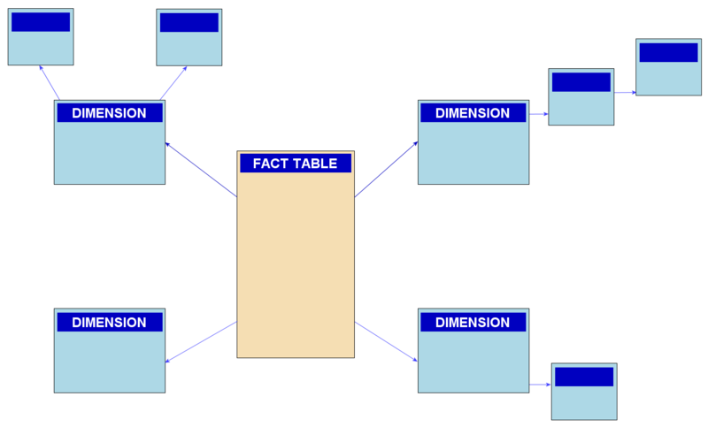

# REVISÃO DE BI

##### O QUE É BI?
- Business Intelligence, processo responsavel por realizar toda a estratégia de coleta e extração de dados valiosos para a empresa, transformando-os em informações relevantes para a tomada de decisão.

##### COMO O BI FAZ ISSO? 
- O BI faz isso através de um processo chamado **ETL**, que significa Extract, Transform and Load, ou seja, Extrair, Transformar e Carregar. O ETL é um processo que extrai os dados de diversas fontes, transforma-os em um padrão e os carrega em um banco de dados, onde serão armazenados e utilizados para a criação de relatórios e dashboards.

- Temos fontes de dados, um arquivo csv, um processo de ETL e um banco de dados, agora precisamos de uma ferramenta para criar os relatórios e dashboards, e é aí que entra o Power BI.

-O processo de ETL carrega os dados no **DATA WAREHOUSE** e o Power BI se conecta ao DATA WAREHOUSE para criar os relatórios e dashboards.

##### O QUE É O POWER BI?
- O Power BI é uma ferramenta de Business Intelligence da Microsoft, que permite a criação de relatórios e dashboards de forma simples e intuitiva, com uma infinidade de possibilidades de visualizações e interações

##### O QUE SÃO FONTES DE DADOS?
- Fontes de dados são os locais onde os dados estão armazenados, podem ser arquivos csv, excel, bancos de dados, etc.

##### O QUE É UM DATA WAREHOUSE?
- Data Warehouse é um banco de dados que armazena os dados de forma estruturada, para que possam ser utilizados para a criação de relatórios e dashboards.

##### O QUE SÃO RELATÓRIOS E DASHBOARDS?
- Relatórios e dashboards são as visualizações dos dados, onde podemos analisar e extrair informações relevantes para a tomada de decisão.

#### COMO TRATAR ESSES DADOS E TRABALHAR COM ELES? COMO TRANSFORMAR EM ALGO MAIS ESTRUTURADO?
    - O processo de ETL é responsável por isso, ele extrai os dados de diversas fontes, transforma-os em um padrão e os carrega em um banco de dados, onde serão armazenados e utilizados para a criação de relatórios e dashboards.

    Temos sempre que deixar os dados prontos para extrações simplificadas, para que possamos extrair informações relevantes para a tomada de decisão.

##### DATA SOURCE > ETL > DATA WAREHOUSE > POWER BI > RELATÓRIOS E DASHBOARDS

##### O QUE É A EXTRAÇÃO DE DADOS?
    - A extração de dados é o processo de coleta de dados de diversas fontes, como arquivos csv, excel, bancos de dados, etc.

##### O QUE É A TRANSFORMAÇÃO DE DADOS?
    - A transformação de dados é o processo de transformar os dados extraídos em um padrão, para que possam ser carregados em um banco de dados.

##### O QUE É O CARREGAMENTO DE DADOS?

    - O carregamento de dados é o processo de carregar os dados transformados em um banco de dados, onde serão armazenados e utilizados para a criação de relatórios e dashboards.

#### O QUE É SUMARIZAÇÃO?
    -Sumarização é o processo de sumarizar os dados, ou seja, de agrupar os dados de acordo com uma determinada característica, como por exemplo, somar o total de vendas por vendedor.

##### O QUE É TRADUÇÃO DE DADOS?
    - Tradução de dados é o processo de traduzir os dados, ou seja, de alterar o idioma dos dados, como por exemplo, alterar o idioma de inglês para português.

##### O QUE É A LIMPEZA DE DADOS?
    - A limpeza de dados é o processo de limpar os dados, ou seja, de remover dados duplicados, dados inválidos, etc.

##### O QUE É CARDINALIDADE DE DADOS?
    - Cardinalidade de dados é o processo de definir a cardinalidade dos dados, ou seja, de definir se os dados são únicos ou não, como por exemplo, definir se o CPF é único ou não.

### CARREGAMENTO
    -Neste momento os dados estão em um banco central, que é o DATA WAREHOUSE, e o Power BI se conecta ao DATA WAREHOUSE para criar os relatórios e dashboards.

#### O QUE É A MODELAGEM DE DADOS?
    - A modelagem de dados é o processo de modelar os dados, ou seja, de definir como os dados serão armazenados no banco de dados.

#### STAR SCHEMA
    - O Star Schema é um modelo de modelagem de dados, onde temos uma tabela central, chamada de tabela fato, e diversas tabelas ao redor, chamadas de tabelas dimensões.

    - A tabela fato é a tabela central, onde temos os dados numéricos, como por exemplo, o valor de vendas, o valor de custo, etc.

    - As tabelas dimensões são as tabelas ao redor, onde temos os dados descritivos, como por exemplo, o nome do vendedor, o nome do produto, etc.

    - A tabela fato se relaciona com as tabelas dimensões através de chaves estrangeiras, que são os campos que relacionam as tabelas.

    - O Star Schema é o modelo mais utilizado para a criação de relatórios e dashboards, pois é um modelo simples e eficiente.

#### SNOW FLAKE
    - O Snow Flake é um modelo de modelagem de dados, onde temos uma tabela central, chamada de tabela fato, e diversas tabelas ao redor, chamadas de tabelas dimensões.

    - A tabela fato é a tabela central, onde temos os dados numéricos, como por exemplo, o valor de vendas, o valor de custo, etc.

    - As tabelas dimensões são as tabelas ao redor, onde temos os dados descritivos, como por exemplo, o nome do vendedor, o nome do produto, etc.

    - A tabela fato se relaciona com as tabelas dimensões através de chaves estrangeiras, que são os campos que relacionam as tabelas.

    - O Snow Flake é um modelo mais complexo que o Star Schema, pois as tabelas dimensões podem se relacionar com outras tabelas dimensões, o que não acontece no Star Schema.

    - O Snow Flake é um modelo pouco utilizado para a criação de relatórios e dashboards, pois é um modelo complexo e pouco eficiente.

